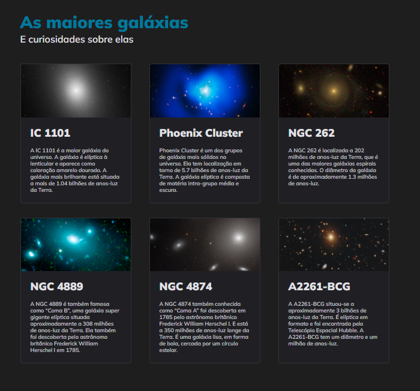

<!DOCTYPE html>
<html lang="pt-BR">
<head>
  <meta charset="UTF-8">
  <meta name="viewport" content="width=device-width, initial-scale=1.0">
</head>
<body>
  <header>
    <h1>Galaxies</h1>
    

      This screen was created to practice the principles of display grid.
    

  </header>

  <section>
    <h2>Screen</h2>
    
  </section>
